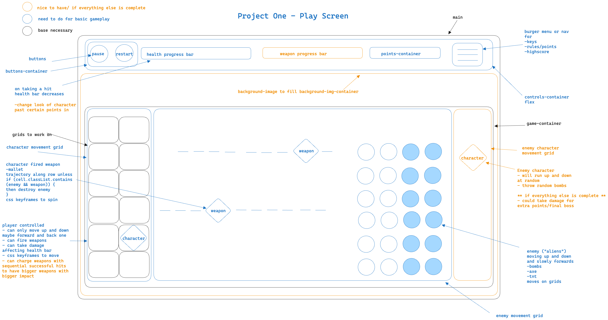
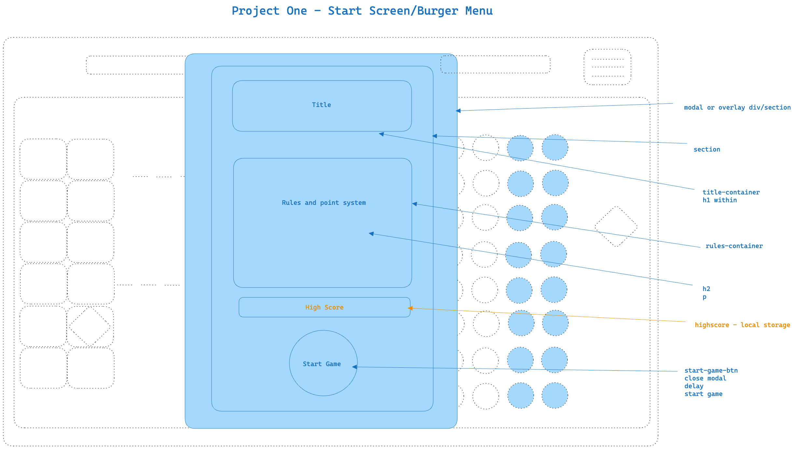
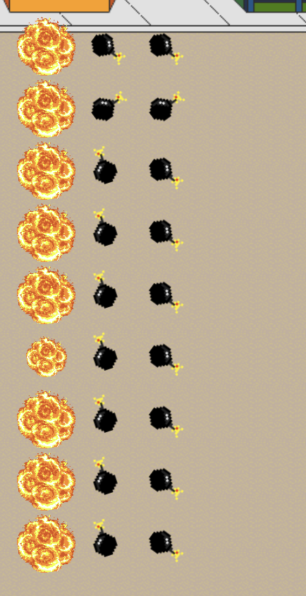
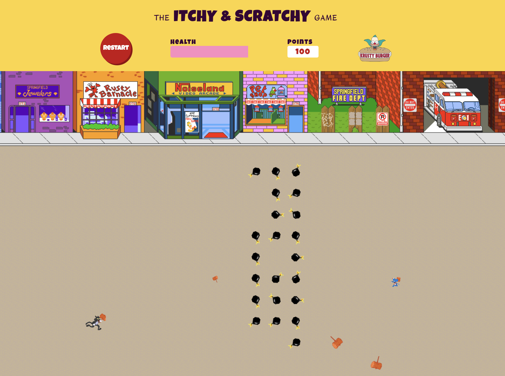
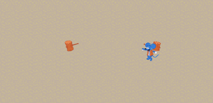
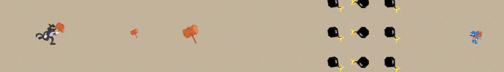

# Itchy & Scratchy - Battle Royale

## Description

Itchy and Scratchy - Battle Royale, is a take on space invaders featuring the dynamic duo from The Simpsons. This was completed during our third week of the Software Engineering course with a 7 day timeline, and using HTML, CSS and JavaScript.

## Deployment link

[The Itchy & Scratchy Game Live Link](https://adraf.github.io/itchy-and-scratchy-space-invaders/)

## Timeframe & Working Team (Solo)

Solo Project - 1 week.<br>
Start planning Thursday 2nd Nov 2023 for presentations Friday 10th Nov 2023.

## Technologies Used

* Excalidraw - wireframing
* [Pixilart](https://www.pixilart.com/draw) - 8 bit drawings
* [The Spriters Resource](https://www.spriters-resource.com/) - for SNES sprites and sounds
* [Frinkiac](https://frinkiac.com/) - for Simpsons gifs
* Procreate
* HTML
* CSS
* JavaScript
* VS Code
* Chrome DevTools
* GitHub

## Brief

#### Technical Requirements
Your app must:
* Render a game in the browser
* Be built on a grid: do not use HTML Canvas for this
* Design logic for winning & visually display which player won
* Include separate HTML / CSS / JavaScript files
* Stick with KISS (Keep It Simple Stupid) and DRY (Don't Repeat Yourself) principles
* Use JavaScript for DOM manipulation
* Deploy your game online
* Use semantic markup for HTML and CSS

#### Necessary Deliverables
* A working game, built by you, hosted somewhere on the internet
* A link to your hosted working game in the URL section of your Github repo
* A git repository hosted on Github, with a link to your hosted game, and frequent commits dating back to the very beginning of the project
* A readme.md file with explanations of the technologies used, the approach taken, installation instructions, unsolved problems, etc. (completed post project)

#### Space Invaders
Space Invaders is a classic arcade game from the 80s. The player aims to shoot an invading alien armada, before it reaches the planet's surface using a mounted gun turret.

The player can only move left or right. The aliens also move from left to right, and also down each time they reach the side of the screen. The aliens also periodically drop bombs towards the player.

Once the player has destroyed a wave of aliens, the game starts again. The aim is to achieve the highest score possible before either being destroyed by the aliens, or allowing them to reach the planet's surface.

#### Requirements
* The player should be able to clear at least one wave of aliens
* The player's score should be displayed at the end of the game

#### Suggested enhancements
* Responsive design
* Each wave gets more difficult
* Persistent leaderboard using localStorage


## Planning

#### Wireframing
Everything in black and blue was basic functionality for the game to work. The orange notes were for further development and enhancements (“nice to have”) once the game was up and running. 

#### Ideas
The aim is for gameplay to be a cross between space invaders and an older arcade street fighter game. It will be side on, and I’ll have a health bar instead of lives. I also want to include as much animation as I can. But this will be once I have the basic game mechanics working.





#### Pseudocode

* Google Font options
* Elements
* Executions
* Grid
* Events
* Page Load

I wrote out all the things that were to be included in the project, events that would need to happen, what would be needed on page load, executions and animations that would happen throughout gameplay and information that would be included on modals at the start and on finishing the game. If there were snippets of code I had researched or pointers on how to do things, those were added in too.
I also thought about the user journey as to what they would see or need at each step and where I could reuse functions and event listeners. 

## Build/Code Process

#### Thursday Day .5 
Planning, wireframing and pseudocode
Friday Day 1 
Finalise planning, HTML written, start of functions to add grid, add player character, add enemy elements. Stuck on getting enemy elements to move, and a better way to get them added to the board to make the code for moving them more streamlined.
#### Saturday Day 2 
Able to add the player weapon, throw the weapon and track its trajectory, and also have the weapon and enemy elements make contact. This prompts classes to change which adds/removes elements and adds explosions.
#### Sunday Day 3 
Corrected enemy bomb explosions, refactored some functions and made code more DRY, now able to make bombs move (up, left, down, first step in automating movement and directional changes). 
#### Monday Day 4 
Roadblock - stuck on getting enemy bombs to move in a pattern and down the grid towards the player. Animation was jumping steps and I wasn’t properly able to access the bomb information to use them or give them direction. Changing tack and creating an array of bombs so that there’s more access to them individually and can give them all rules so they know where they are on the grid in relation to boundaries, weapons and the player. 
Took a break from this mid-afternoon to begin adding in more CSS styling, as I have spent a long time on the bomb functionality today. 
#### Tuesday Day 5 
Success! Bomb array is now working (I have talked about this in the Challenges section), more styling has been added in and the player can gain points and lose health in game play. 
#### Wednesday Day 6
Bombs are able to register when they reach the end of the grid, causing them to explode and signalling game over (see `endBombs()` and below). When the player hits them and makes them explode individually during game play they are removed from the pack and maintain the blank space (see `explosion()` below). I have also added a function for randomised enemy weapons that are thrown toward the player column from different locations in the enemy column.
Modals have been added for start of the game and game over, as well as an overlaying side menu to look up instructions mid game. Players can win and lose the game, and some audio has been added.

#### `endBombs()`
The endBombs function pulls from an array called endZone that lists the 11 cell numbers at the end of the row. As I had odd numbers there wasn’t a clear concise maths equation to see where the rows ended. It then loops through the cells to see when a cell contains both a ‘bomb’ or ‘player’ and an ‘endZone’ class and then stops the bomb intervals movement. 
```javascript
if ((cell.classList.contains('endZone') || cell.classList.contains('player')) &&  cell.classList.contains('bomb'))
```
It then uses the pre-existing class to add an explosion animation to the column of existing bombs and removes the bomb class. 
```javascript
cell.classList.add('kaboom')
```
If the player is standing in the blast zone then a little skeleton animation will run as the Game Over modal pops up. 
```javascript
function endBombs() {
  for (let i = 0; i < cells.length; i++) {
    const cell = cells[i]
    if ((cell.classList.contains('endZone') || cell.classList.contains('player')) &&  cell.classList.contains('bomb')) {
      clearInterval(bombMovement)
      cell.classList.add('kaboom')
      cell.classList.remove('bomb')
      // removes explosion gif after 1 second
      setTimeout(function() {
        cell.classList.remove('kaboom')
      }, 1000)
      if (cell.classList.contains('player')) {
        cell.classList.add('playerSkeleton')
        cell.classList.remove('player')
      }
      gameOver()
    }
  }
}
```



#### `explosion()`
The explosion function is looking to see when a weapon has connected with a bomb so that we can remove it from the game board. 
```javascript
 if (cells[launchPoint].classList.contains('bomb') && cells[launchPoint].classList.contains('weapon'))
 ```
 When this happens the weapon’s `setInterval` is stopped, the weapon and bomb are removed from the cell and an explosion gif and sound are added in their place. I then added a `find()` to look through the bomb array for the one we just blew up, and filtered the array to remove it. This means we maintain the bomb grid and movement due to the rules in the `bombAnimation()` function and see the gaps the player has made. As you can see in the screenshot there are some glitches where the bombs have moved and the mallet has made late contact and somehow finds a way through, to blow up a central bomb.
```javascript
function explosion(launchPoint, countAcross) {
  if (cells[launchPoint].classList.contains('bomb') && cells[launchPoint].classList.contains('weapon')) {
    clearInterval(countAcross)
    cells[launchPoint].classList.add('kaboom')
    explosionAudio.play()
    cells[launchPoint].classList.remove('bomb')
    // finds bomb array and deletes exploded bomb from array
    const findBomb = bombs.find(bomb => bomb === Number(cells[launchPoint].id))
    bombs = bombs.filter(item => item !== findBomb)
    // adds points for hit
    pointsCounter.innerText = Number(pointsCounter.innerText) + hitBombPoints
    removeWeapon(launchPoint)
    // removes explosion gif after 1 second
    setTimeout(function() {
      cells[launchPoint].classList.remove('kaboom')
    }, 1000)
  }
}
```



#### Thursday Day 7 
Final bug fix touches and functions. Added in the ability to save high scores to `localStorage`, the enemy now moves to different locations to launch weapons and you can get bonus points for hitting them, and there’s also some final styling and audio additions.

#### `getEnemyLaunchPoint()`
This function adds in similar game play as the original space invaders in that as well as the slowly moving enemy elements there are also randomly fired extra weapons to dodge. Every 4 seconds a random number is generated that is equal to the last cell in each row which is the enemy character’s column. This began as randomly fired elements and a static character. What I went on to include on this day is that the enemy character takes the cell number as the location to be added to, so it looks more like they are the one launching things at the player. The enemy character was repeating every 4 seconds, so to combat this, the enemy is removed from the current position towards the start of the function, we get the new cell number position, assign that to the ‘currentEnemyPos’ variable and add the enemy to that position. Meaning that when we start again the enemy character is removed from the previous ‘current position’ and then assigned to an updated one. 
let randomTime
```javascript
function getEnemyLaunchPoint(){
  randomTime = setInterval(() => {
    let enemyLaunchPoint
    const runNumber = Math.floor(Math.random() * height) * width - 1
    if (runNumber > 0) {
      removeEnemy(currentEnemyPos)
      enemyLaunchPoint = Number(cells[runNumber].id)
      currentEnemyPos = enemyLaunchPoint
      startEnemyWeapon(enemyLaunchPoint)
      addEnemy(enemyLaunchPoint)
    }
  }, 4000)
}
```



#### Friday Day 7.5 - Presentation Day
Bug fixes and audio. I fixed a bug where the health bar wouldn’t shake on each hit the player took, and also added sound as the health bar decreased. I also added a fix so that the player weapons wouldn’t continue off the end of the board and onto the next row (I’ve talked about this in Wins). I also added a lot more audio for the characters to make game play more fun. 

#### Game Play Gif


## Challenges

My biggest challenge was getting the bombs to automatically move down the page. I could get them to move up, down and left, I could get the setInterval to work, but I couldn’t put it all together. I tried different ways, with things in separate functions, different if…else statements to make sure they didn’t go past the boundary of the game grid but this was causing the animations to skip or go one step and break. I was then given the tip of looking into an array for the bombs. I had already written a lot of code to get the bombs added to the page in a different way but this clearly wasn’t working and I think I’d made it too complicated to start with.
This array was then used in a more simple if…else statement with minimal rules to slightly change the direction when necessary rather than trying to program in every cell movement it needed to make. 
```javascript
function bombAnimation() {
  createGrid()
  addBombs()
  bombMovement = setInterval(() => {
    removeBombs()
    //movedown
    if (direction === 'down') {
    //check for boundary
      const cont = bombs.every(bomb => {
        return bomb + width < cellCount
      })
      bombs = bombs.map(bomb => {
        // is bomb + width (moving down) less than the border, if yes move down again otherwise go left
        return cont ? bomb + width : bomb - 1
      })
      if (!cont) {
        direction = 'up'
      }
    } else {
      const cont = bombs.every(bomb => {
        return bomb - width >= 0
      })
      bombs = bombs.map(bomb => {
        return cont ? bomb - width : bomb - 1
      })
      if (!cont) {
        direction = 'down'
      }
    }
    addBombs()
    endBombs()
    winGame()
  }, 1200)
}
```

Player weapons were not firing properly initially and would double up or stop halfway across the game board. I had been using empty functions, so needed to feed in the variable to the `addWeapon` function as previously it had been using a globally scoped start point and wasn’t being updated with the locally scoped positions. 
```javascript
function startWeaponTrajectory(launchPoint)
```

## Wins

Feeding in variables to functions. This is a key part of functions but not one I’d had the chance to use a lot before. For example, being able to set a position and then in future functions feed in the new location was instrumental in being able to move characters and weapons. 

Previously when multiple weapons were launched in quick succession it meant that some weapons didn’t register that they had reached the end of the row and that they needed to stop, and they continued on to the next. I then added a setTimeout to the start of the function that runs for the width of the game board as a fail-safe and stops any of the outliers skipping onto the next row. 

Getting `localStorage` to log the high score of the players. This then also pushes to the modals and overlay side menu. I know that the bottom of the code that updates the HTML definitely could have been more DRY, I will add it to my to-do list. 
```javascript
function logHighScore() {
  const highScoreLocalStorage = Number(localStorage.getItem('highScore')) || 0
  if (Number(pointsCounter.innerText) > highScoreLocalStorage) {
    localStorage.setItem('highScore', pointsCounter.innerText)
    const localHighScore = localStorage.getItem('highScore')
  }
  const updatedHighScore = Number(localStorage.getItem('highScore')) || 0
  document.querySelector('#high-score-game-over').innerHTML = `High Score<br>${updatedHighScore}`
  document.querySelector('#high-score-burger').innerHTML = `High Score<br>${updatedHighScore}`
  document.querySelector('#high-score-intro').innerHTML = `High Score<br>${updatedHighScore}`
}
```

## Key Learnings/Takeaways

Make sure to take breaks! Taking even 5 minutes away from the screen gives you a chance to reset, and also the chance to take time to think about the problem without the code in front of you can make a world of difference. Otherwise I end up trying out lots of code, but I found writing it down in plain english to break down the points of the issue and things I would need to try in order, was really helpful to fix things. I was told about rubber duck debugging and didn’t realise this was something I had been doing on occasion, but with my wife. Although by this point she is listening to me talk about code as much as the duck would. 

Using Chrome DevTools to edit the CSS of elements and see immediate changes is such a time saver and my new favourite way of coding CSS. It makes things like flexbox for example, which I already enjoyed, a lot more streamlined and easier to get right the first time. 

I feel more confident on scope with functions and also setIntervals than I did before, although I do still have some bugs which I believe are related to setInterval so I’m not all the way there yet.

Slowing down my process and making sure to log between sections to make sure I get the desired result before moving on has helped me code smarter. Overall I think more patience and time to think on issues rather than barrelling in with code, saved me more time in the long run.

## Bugs

Some of the sounds, like the explosions won’t repeat until they have finished playing. I had looked into fixes and saw some options with functions and cloning but this was a minor issue in the overall build. The final audio on game over repeats itself which again I believe is linked to the setIntervals continuing to run in the background.

## Future Improvements

I’d like to make the enemy projectiles being thrown into HTML images so that they would fly over the top of the `background-image` rather than replacing bombs as they go through the grid of  bombs to make it look a bit more realistic. 

The point of the overlay side menu was for users to have access to the instructions for the controls and the point system mid game, but mainly to be able to pause the game should they need to. I could get as far as everything stopping apart from the enemy projectiles. They would continue which would continue to cause player damage. I believe it’s to do with the local scope of the enemy weapon’s setInterval so I’m unable to clear it. 
Possibly an if…else statement within the setInterval linked to the display of the overlay menu `(if menu width !== 0 clearInterval())`.
If I could get this working, it would also mean that I could get to a point where the restart and start buttons could function without a page refresh. 

I also wanted to give the player points when player weapons connected with enemy projectiles, effectively stopping the enemy projectiles getting near. I could get a console.log when this was happening but it was so intermittent that it didn’t make set gameplay for now. Although in the classic Space Invaders you can’t shoot incoming projectiles so maybe my game’s just a bit retro!



Also some other updates would be:
* The ability to hit the enemy character 3 times to get extra points and destroy them.
* Mute button and audio choices.
* Further levels with varying difficulties.
